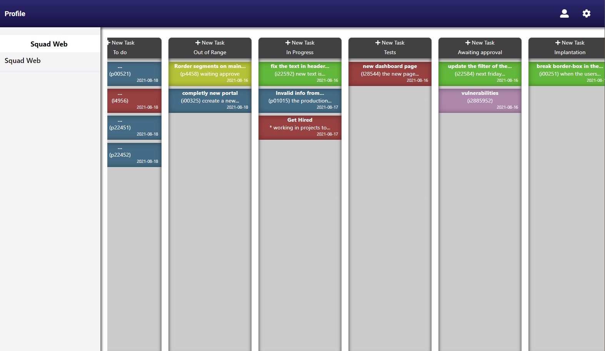
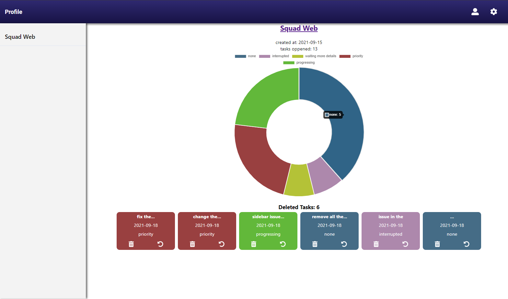

# planner-task-node
 

 If you want to take a look on all screens of the App, click <a href="https://gabrielp-oliveira.github.io/planner-task/#/" target="_blank">here.</a>

<strong>OBS:. use google chrome or firefox for more efficient.</strong>

<h2>Goal</h2> 

<i>"Use my knowledge to improve and test my skills as a programmer".:rocket:</i>

This project is part of my portfolio, so feel free to get in touch for feedback on the code, structure or other reason that will help me become a better programmer!

E-mail: <a>gabriel.pso100@gmail.com</a > 
<a target="_blank" href="https://www.linkedin.com/in/gabriel-97-oliveira">linkedin</a> 

<h2>Observations</h2>
<Strong></strong>

inspired in the <Strong>Microsoft Planner</strong>, this tool helps you to <Strong>create</strong> a <Strong>simple</strong> and <Strong>visual</strong> way to organize work that is updated in <Strong>real time </strong>for the entire team.

If you want to check the Back-end repository, click <a target="_blank" href="https://github.com/gabrielp-oliveira/planner-task-node"> here</a>.

This app is hosted on <strong>heroku free plan</strong>, meaning that on the initial load, the server mat neet to start which can cause a <strong>delay</strong>.

<h2>Functionalities</h2>
• Register and login a personal account, with email authentication and possibility to change the pasword. 
• Saved all the tasks and planner in a database. 
• update all changes to everyone connected in that planner at the same time. 
• limit the acess of a user depending of her acess.  

<h2>Cloning the Repository</h2>
$ git clone https://github.com/gabrielp-oliveira/planner-task-node 
$ cd cd planner-task-node 
$ npm install
 

<h2>setting the app</h2>
Now, three things are importants: 

if you run this app in local environment, you have to had install the <strong>mongodb and node js</strong>  to get everything in work.

you can find the methodology to <strong>cloning and config the Back-end repository <a target="_blank" href="https://github.com/gabrielp-oliveira/planner-task-node"> here</a></strong>.

its important create a <strong>.env</strong>  file in the root application with the following variables:

<strong>REACT_APP_SERVER_URL </strong> <i>---- </i>this url its the back-end server. if you dont config this variable, by default the url will be http://localhost:8080  

<h2>Built With</h2>
• axios  
• chart.js  
• material-ui 
• react 
• react-beautiful 
• fontawesome 
• socket.io 
• typescript 

E-mail: <a>gabriel.pso100@gmail.com</a > 

<a href ="http://www.linkedin.com/in/gabriel-97-oliveira" target="_blank">LinkedIn</a>  

:thumbsup:
 